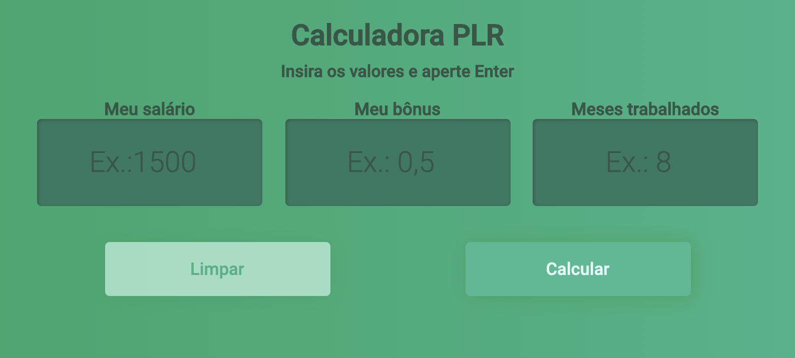

# calculadora PLR

Uma calculadora simples para auxiliar no cálculo da participação dos lucros de uma empresa.

## My Goals:
- [x] Understanding CSS3 Flexbox;
- [x] Controling DOM;
- [x] Using pure JavaScript;
- [x] Using JavaScript currency conversor;

**You can see the live demo on [Calculadora PLR Demo](http://calculadora-plr.vercel.app/).**
